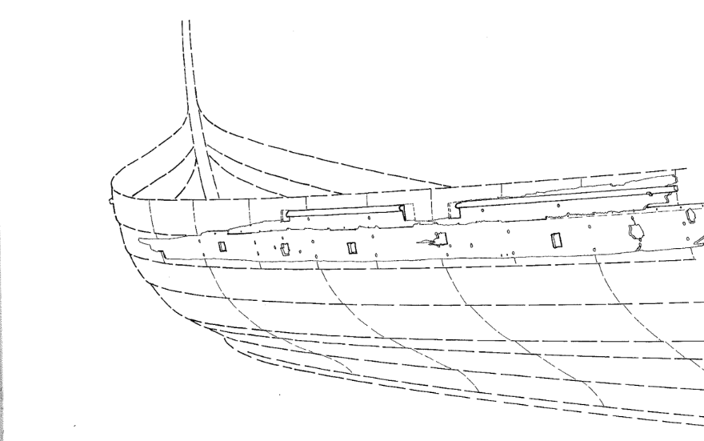

**_oarhole, oarport_** (English); _årehul_ (Danish); _Riemenloch_ (German)

_**hár** f., pl. háir_ (Old Norse) [citation: [prose](https://onp.ku.dk/onp/onp.php?o31447)/[poetry](https://lexiconpoeticum.org/m.php?p=lemma&i=31982)]     
_**hamla** f., pl. hǫmlur_ (Old Norse) [citation: [prose](https://onp.ku.dk/onp/onp.php?o31115)/[poetry](https://lexiconpoeticum.org/m.php?p=lemma&i=31626)]   

  Holes situated within the upper strakes in the hull of Viking ships, allowing the crew to man the oars (Crumlin-Pedersen, 116).

  
    
  Reconstruction drawing of a section of the upper strakes and oarports of a vessel excavated in Hafenstrasse, Schelswig-Holstein, Germany (Crumlin-Pedersen, 1996, Figure 5.12, p116).

  A common practice was to levy taxes based on the amount of oarports present on a ship; Harthacnut's tax of 8 marks on each crew member, for example, was tabulated by the number of oarsmen's places (oarports) (Jesch, 156). Jesch discusses the occurence of these two words throughout the Skaldic corpus; though the words were oftentimes utilized in different contexts, both tend to refer metaphorically to the oarmen's place the oar, as opposed to a specific device (Jesch, 156).
         

---

  Jesch, Judith. _Ships and Men in the Late Viking Age: The Vocabulary of Runic Inscriptions and Skaldic Verse._ NED-New edition. Woodbridge, Suffolk, UK ; Rochester, NY: 
Boydell & Brewer, 2001. https://www.jstor.org/stable/10.7722/j.ctt163tb4f.

  Crumlin-Pedersen, Ole. 1996. _Viking-Age Ships and Shipbuilding in Hedeby._ Illustrated edition. Roskilde: Viking Ship Museum.

