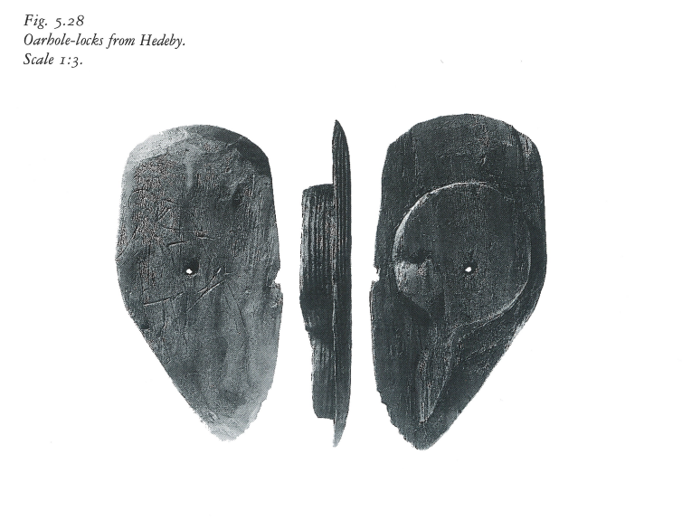

**_oarport, oarhole_** (English); _årehul_ (Danish); _Riemenloch_ (German)

_**hár** f., pl. háir_ (Old Norse) [citation: [prose](https://onp.ku.dk/onp/onp.php?o31447)/[poetry](https://lexiconpoeticum.org/m.php?p=lemma&i=31982)]   
_**há-bora** f., pl. háborurnar, haborum_ (Old Norse) [citation: [prose](https://onp.ku.dk/onp/onp.php?o30226)]  

  A hole within the hull of the ship, with which 

  
    
  Oarhole-lock from ship found in the Hedeby harbor, located in present-day Busdorf, Schelswig-Holstein, Germany. (Nicolaysen, 1911, Figure 5.28, p127)

  Various sources of combined evidence suggest that these locks may have been part of the personal equipment brought onboard by the crew, as opposed to a standard element of the ship's equipment (Crumlin-Petersen, 126).     

---

  Jesch, Judith. _Ships and Men in the Late Viking Age: The Vocabulary of Runic Inscriptions and Skaldic Verse._ NED-New edition. Woodbridge, Suffolk, UK ; Rochester, NY: 
Boydell & Brewer, 2001. https://www.jstor.org/stable/10.7722/j.ctt163tb4f.

  Crumlin-Pedersen, Ole. 1996. _Viking-Age Ships and Shipbuilding in Hedeby._ Illustrated edition. Roskilde: Viking Ship Museum.

