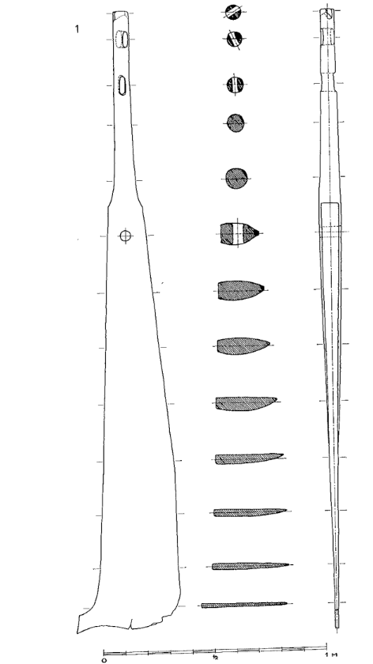

**_rudder_** (English); _ror_ (Danish); _Rudder_ (German)

_**stýri** n, pl. stýri_ (Old Norse) [citations: [prose](https://onp.ku.dk/onp/onp.php?o76543)/[poetry](https://lexiconpoeticum.org/m.php?p=lemma&i=80522)]  

  Rudders, located externally at the rear of viking ships, served as the primary means of steering. 

  
    
  Oar from the Gokstad ship (Nicolaysen Pl. V, Fig. 1)

  Oars were critical for moving and steering Viking ships, especially in unfavorable wind conditions, on rivers, and in close quarters naval combat. It is known that oars were painted and carved, adding character to indivdual oars (Jesch, 154).  The largest Viking ships could have more than 30 oars per side (Crumlin-Pedersen, 92).   

---

  Jesch, Judith. _Ships and Men in the Late Viking Age: The Vocabulary of Runic Inscriptions and Skaldic Verse._ NED-New edition. Woodbridge, Suffolk, UK ; Rochester, NY: 
Boydell & Brewer, 2001. https://www.jstor.org/stable/10.7722/j.ctt163tb4f.

  Crumlin-Pedersen, Ole. 1996. _Viking-Age Ships and Shipbuilding in Hedeby._ Illustrated edition. Roskilde: Viking Ship Museum.

