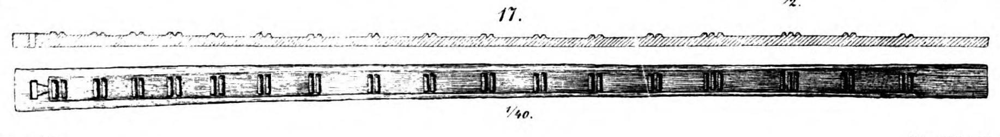

**_gangplank_** (English); _åre_ (Danish); _Riemen_ (German)

_**bryggja** f., °-u; -ur, gen. bryggna_ (Old Norse) [citations: [prose](https://onp.ku.dk/onp/onp.php?o4167)/[poetry](https://lexiconpoeticum.org/m.php?p=lemma&i=11326)]  

  A wide plank of wood, used to cross from a ship onto land or harbor. Such artifacts were among the most important tools on Viking ships, they allowed for rapid transport of goods and people to and from ships.      

  
  
  Gangplank from the Gokstad ship (Nicolaysen Pl. V, Fig. 17)

     

---

  Jesch, Judith. _Ships and Men in the Late Viking Age: The Vocabulary of Runic Inscriptions and Skaldic Verse._ NED-New edition. Woodbridge, Suffolk, UK ; Rochester, NY: 
Boydell & Brewer, 2001. https://www.jstor.org/stable/10.7722/j.ctt163tb4f.

  Crumlin-Pedersen, Ole. 1996. _Viking-Age Ships and Shipbuilding in Hedeby._ Illustrated edition. Roskilde: Viking Ship Museum.

