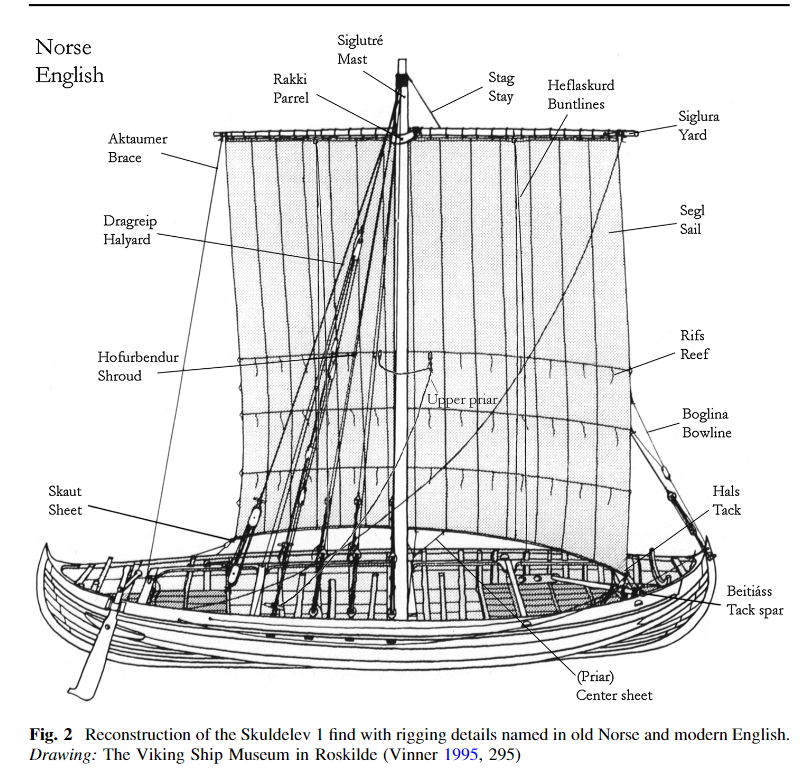

**_running rigging_** (English); _løbende rig_ (Danish); _laufendes Gut_ (German)

_**reiði** n., pl. reiði_ (Old Norse) [citations: [prose](https://onp.ku.dk/onp/onp.php?o65885)/[poetry](https://lexiconpoeticum.org/m.php?p=lemma&i=69061)]

Ropes used for manipulating the sail and holding the mast in place. Ropes supporting the mast are considered standing rigging, whereas the ropes that manipulate the sail are referred to as running rigging.

  
    
  
 Old Norse makes little distinction in the differences between types of rigging, especially on warships, where the mast was frequently raised and lowered. Jesch notes that the Old Norse word for tackle, reiði, was often used as a general descriptor for rigging. (Jesch, 165) 

     

---

  Jesch, Judith. _Ships and Men in the Late Viking Age: The Vocabulary of Runic Inscriptions and Skaldic Verse._ NED-New edition. Woodbridge, Suffolk, UK ; Rochester, NY: 
Boydell & Brewer, 2001. https://www.jstor.org/stable/10.7722/j.ctt163tb4f.

  Crumlin-Pedersen, Ole. 1996. _Viking-Age Ships and Shipbuilding in Hedeby._ Illustrated edition. Roskilde: Viking Ship Museum.

