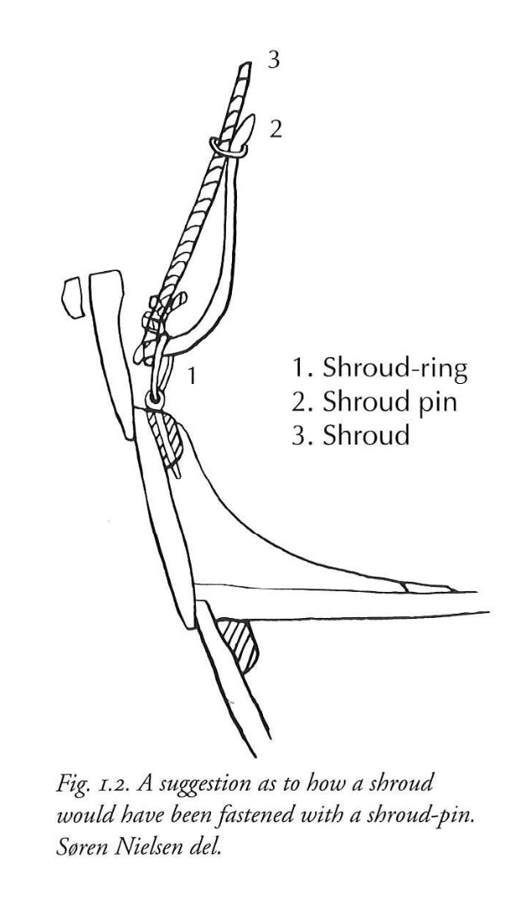

**_shroud_** (English); _vant_ (Danish); _Want_ (German)  
**_shroud-pin_** (English); _vantnål_ (Danish); _Wantnadel, Wantenspanner_ (German)  

_**hanki** noun m., pl. hanki_ (Old Norse) [citations: [prose](https://onp.ku.dk/onp/onp.php?o31397)/[poetry](https://lexiconpoeticum.org/m.php?p=lemma&i=31926)]

  Part of the standing rigging apartus, used to fasten the rope supporting the ship's mast.    

  
    
  Rendition of shroud and shroud pin (Sørensen 2001, Figure 1.2, p17)

   

---

  Jesch, Judith. _Ships and Men in the Late Viking Age: The Vocabulary of Runic Inscriptions and Skaldic Verse._ NED-New edition. Woodbridge, Suffolk, UK ; Rochester, NY: 
Boydell & Brewer, 2001. https://www.jstor.org/stable/10.7722/j.ctt163tb4f.

  Crumlin-Pedersen, Ole. 1996. _Viking-Age Ships and Shipbuilding in Hedeby._ Illustrated edition. Roskilde: Viking Ship Museum.

