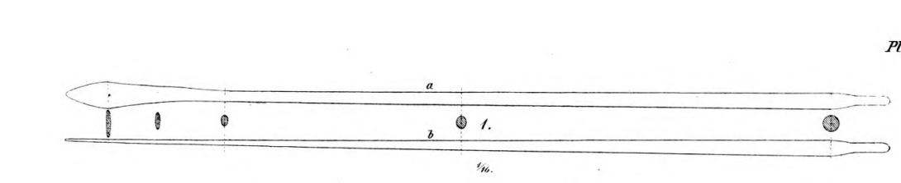

**_oar_** (English); _åre_ (Danish); _Riemen_ (German)

_**ár** f., pl. árar_ (Old Norse) [citations: [prose](https://onp.ku.dk/onp/onp.php?o4167)/[poetry](https://lexiconpoeticum.org/m.php?p=lemma&i=4453)]  
_**rœði** n., pl. rœði_ (Old Norse) [citations: [prose](https://onp.ku.dk/onp/onp.php?o65885)/[poetry](https://lexiconpoeticum.org/m.php?p=lemma&i=69061)]

 The main rope which served to support the mast of ships. 

  
    
  Oar from the Gokstad ship (Nicolaysen Pl. V, Fig. 1)

Oars were critical for moving and steering Viking ships, especially in unfavorable wind conditions, on rivers, and in close quarters naval combat. The largest Viking ships could have more than 30 oars per side (Crumlin-Pedersen, 92).   

---

Jesch, Judith. _Ships and Men in the Late Viking Age: The Vocabulary of Runic Inscriptions and Skaldic Verse._ NED-New edition. Woodbridge, Suffolk, UK ; Rochester, NY: 
Boydell & Brewer, 2001. https://www.jstor.org/stable/10.7722/j.ctt163tb4f.

  Crumlin-Pedersen, Ole. 1996. _Viking-Age Ships and Shipbuilding in Hedeby._ Illustrated edition. Roskilde: Viking Ship Museum.

