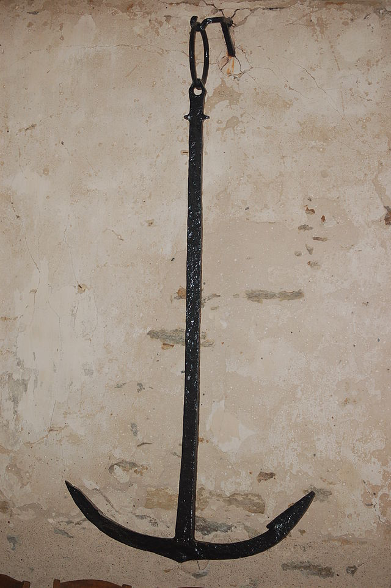

**_anchor_** (English); _anker_ (Danish); _Anker_ (German)

_**akkeri**_ n., pl. _akkeri_ (Old Norse) [citations: [prose](https://onp.ku.dk/onp/onp.php?o1281)/[poetry](https://lexiconpoeticum.org/m.php?p=lemma&i=2907)]  

An object designed to prevent or slow the drift of a ship, by gripping the solid seabed under the body of water.  

  
    
  9th century Iron Anchor discovered in Loire Atlantique, France, and exhibited in  Chapelle de Prigny, France (Perky assumed (based on copyright claims), CC BY-SA 3.0, via Wikimedia Commons)

Anchors were critical for controlling and docking Viking ships, especially in storms or during raids. Anchors were used when camping aboard a ship at night or when preparing for stealthy attacks (Jesch 166). It is believed that Viking Age anchors were made of iron or a composite of wood, stone, and rope. The former would have been expensive and used on large ships while the latter would be more affordable and used on small ships (Crumlin-Pederson, 146). 

---

  Jesch, Judith. _Ships and Men in the Late Viking Age: The Vocabulary of Runic Inscriptions and Skaldic Verse._ (Boydell & Brewer, 2001). https://www.jstor.org/stable/10.7722/j.ctt163tb4f

  Crumlin-Pedersen, Ole. 1996. _Viking-Age Ships and Shipbuilding in Hedeby._ Illustrated edition. Roskilde: Viking Ship Museum.
