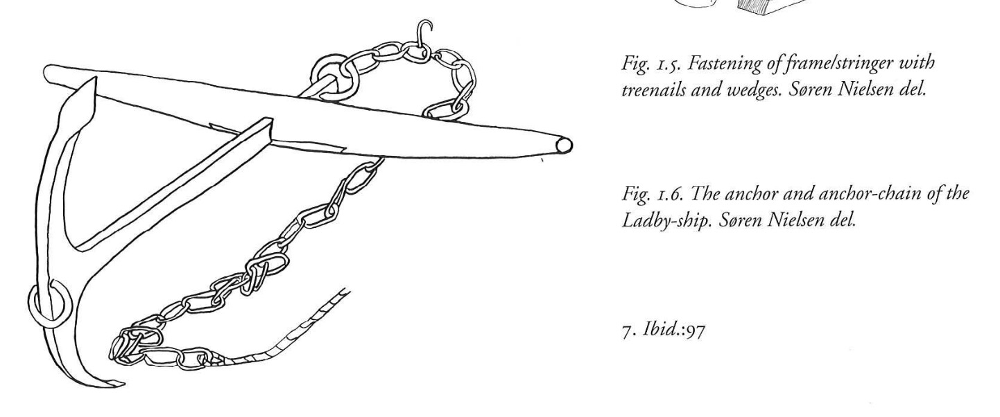

**_anchor_** (English); _anker_ (Danish); _Anker_ (German)

_**akkeri** n., pl. akkerum_ (Old Norse) [citations: [prose](https://onp.ku.dk/onp/onp.php?o1281)/[poetry](https://lexiconpoeticum.org/m.php?p=lemma&i=2907)]  

An object designed to prevent or slow the drift of a ship, by gripping the solid seabed under the body of water.  

  
    
  Anchor and Anchor Chain from Ladby ship (Nicolaysen Pl. V, Fig. 1)

Anchors were critical for controlling and docking Viking ships, especially in storms or raids. (Jesch, 166).

---

  Jesch, Judith. _Ships and Men in the Late Viking Age: The Vocabulary of Runic Inscriptions and Skaldic Verse._ NED-New edition. Woodbridge, Suffolk, UK ; Rochester, NY: 
Boydell & Brewer, 2001. https://www.jstor.org/stable/10.7722/j.ctt163tb4f.

  Crumlin-Pedersen, Ole. 1996. _Viking-Age Ships and Shipbuilding in Hedeby._ Illustrated edition. Roskilde: Viking Ship Museum.
