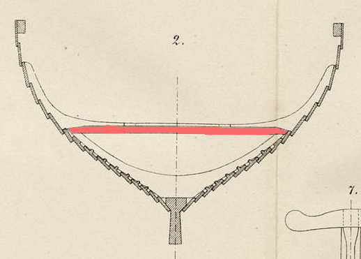

**_biti_** (English); _bite_ (Danish); _Bite_ (German)

**_biti_** m. pl. _bitar_ (Old Norse) [citations: [prose](https://onp.ku.dk/onp/onp.php?o8513)] 

  Lowest cross-beams in the frame, which sit above the ribs, stiffen the ship transversely, and support the deck boards above.  

  
    
  Cross section of the Gokstad ship showing the _biti_ above the rib (Nicolaysen Pl. II, Fig. 2)

  The frame of a Viking ship is formed by the transverse internal structural members: the floor timbers (ribs), beams and naturally curved knees that sit above them (Sørensen 16). Later ships have multiple beams, with the upper thrwarts seperating the rowing rooms and serving as rowing benches (Jesch 151). The Gokstad ship and other early examples have only a single course of _bitis_ supported by central stanchions atop the ribs that in turn hold the deck boards (Bischoff 74).

---

  Bischoff, Vibeke. _The Oseberg Ship: Reconstruction of Form and Function_. Ships & Boats of the North, Volume 9. Roskilde: Viking Ship Museum, 2023.

  Jesch, Judith. _Ships and Men in the Late Viking Age: The Vocabulary of Runic Inscriptions and Skaldic Verse._ NED-New edition. Woodbridge, Suffolk, UK ; Rochester, NY: Boydell & Brewer, 2001. https://www.jstor.org/stable/10.7722/j.ctt163tb4f.

  Nicolaysen, N. (1882). _Langskibet fra Gokstad ved Sandefjord._ Kristiania.

  Sørensen, Anne C. _Ladby: A Danish Ship-Grave from the Viking Age._ Ships and Boats of the North 3. Roskilde: The Viking Ship Museum [u.a.], 2001.

