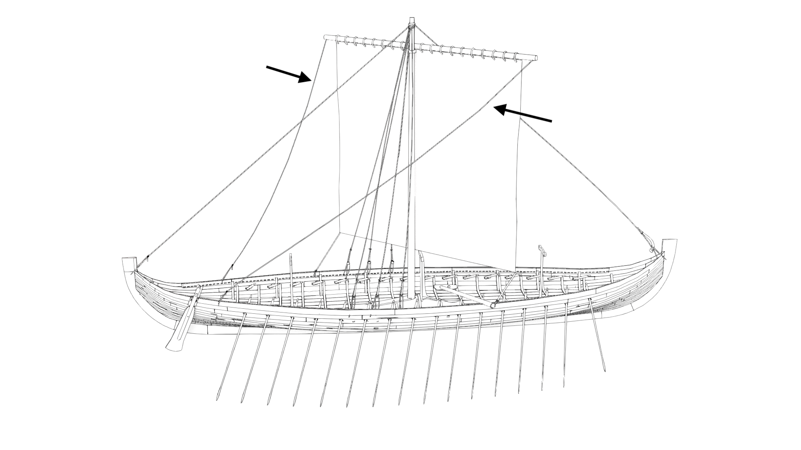

**_braces_** (English); _brase_ (Danish); _Brasse_ (German)

_**aktaumr** m., pl. aktaumar_ (Old Norse) [citations: [prose](https://onp.ku.dk/onp/onp.php?o1392)/[poetry](https://lexiconpoeticum.org/m.php?p=lemma&i=2999)]  
_**stœðingr** m., pl. stœðingar_ (Old Norse) [citations: [prose](https://onp.ku.dk/onp/onp.php?o76631)/[poetry](https://lexiconpoeticum.org/m.php?p=lemma&i=80610)]

  A line leading aft from each yardarm and down to the deck. Braces were used to rotate the ship’s yard (ON _rá_) around its mast (ON _siglu-tré_), allowing the ship to sail at different angles to the wind.   

  
    
  Braces (indicated by arrows) on a model of the Gokstad ship.

  The Old Norse word _aktaumr_ may have also been used to refer to the ship's sheets (ON _skaut_), which were attached to the lower corner of the sail (Egilsson). The rope used for the braces and other rigging was likely made of lime bast (fibrous material from the tree's inner bark), which was waterproof and durable enough to withstand the strain of rough winds on the sail (Sørensen).

---

  Bischoff, Vibeke. "Viking-Age Sails: Form and Proportion." _Journal of Maritime Archaeology_ 12, no. 1 (2017): 1–24. https://doi.org/10.1007/s11457-016-9167-2.

  Egilsson, Sveinbjörn. _Lexicon poëticum antiquæ linguæ Septentrionalis._ Copenhagen: 1860.

  Sørensen, Anne C. _Ladby: A Danish Ship-Grave from the Viking Age._ Ships and Boats of the North 3. Roskilde: The Viking Ship Museum, 2001.
