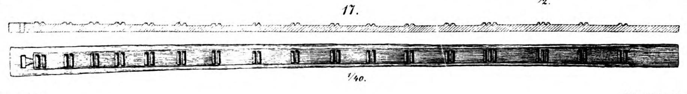

**_gangplank_** (English); _landgangsbro_ (Danish); _Laufplanke_ (German)

_**bryggja** f., pl. bryggjur_ (Old Norse) [citations: [prose](https://onp.ku.dk/onp/onp.php?o11700)/[poetry](https://lexiconpoeticum.org/m.php?p=lemma&i=11326)]  

  A long, narrow plank of wood used as a movable bridge to board a ship or go ashore. 

  
  
  Gangplank from the Gokstad ship (Nicolaysen Pl. VI, Fig. 17)

Gangplanks were vital pieces of equipment in the Viking Age, when ships rarely docked at fixed piers. They could be used to enter, exit and load ships from land, or to board other ships at sea by laying the plank across the gunwales. The Gokstad and Oseberg ship burials both included a _bryggja_ which was hewn from a single piece of pine, recessed on one side so that steps are carved in relief, and fitted with a hole at one end so that it could be fixed to the ship when in use (Nicolaysen, 52; Brøgger et al., 320).

---

  Nicolaysen, N. _Langskibet fra Gokstad ved Sandefjord_. Kristiania: Alb. Cammermeyer, 1882.

  Brøgger, A. W., Hjalmar Falk, and Haakon Shetelig. Osebergfundet. 1. Kristiania: Universitetets Oldsaksamling, 1917. https://urn.nb.no/URN:NBN:no-nb_digibok_2019111248002.
