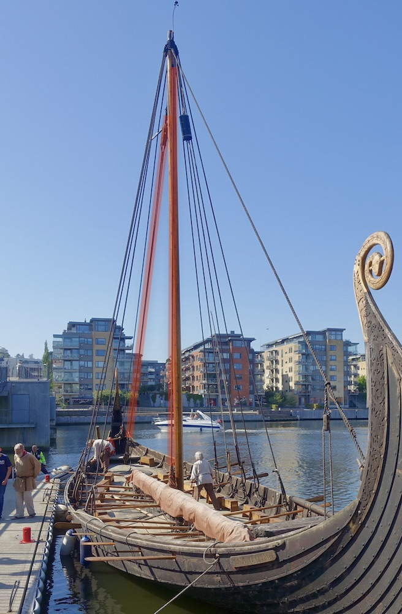

**_halyard_** (English); _reeling_ (Danish); _Fall_ (German)

_**dragreip** n._ (Old Norse) [citations: [prose](https://onp.ku.dk/onp/onp.php?o14994)/[poetry](https://lexiconpoeticum.org/m.php?p=lemma&i=14283)]  

  A rope that is used to raise and lower sails, flags, ladders and yards on the ship. 

  
    
  Halyard (highlighted red) on the replica Saga Oseberg ship (Wolfmann, CC BY-SA 4.0, via Wikimedia Commons)

  The halyard was tied around the yard and went from there through the top of the mast and then down to the halyard tackle (Jesch 161). The sail unfolds as the yard moves up to the halyard hole in the mast top.

---

  Jesch, Judith. _Ships and Men in the Late Viking Age: The Vocabulary of Runic Inscriptions and Skaldic Verse._ NED-New edition. Woodbridge, Suffolk, UK ; Rochester, NY: 
Boydell & Brewer, 2001. https://www.jstor.org/stable/10.7722/j.ctt163tb4f.

  Nielsen, Søren. “‘making Sail.’” “Making sail.” Accessed August 2, 2024. https://www.vikingeskibsmuseet.dk/en/news/making-sail. 

  Wolfmann, _Saga Oseberg viking ship replica 2012 Tønsberg Norway Byfjorden Harbour havn Kaldnes bro footbridge Brygga pier Fore Bow stempost Framstavn etc 2019-08-26 blurred faces 5185.jpg_, CC BY-SA 4.0, via Wikimedia Commons. 
