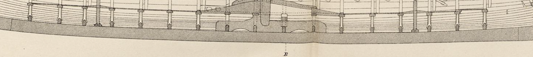
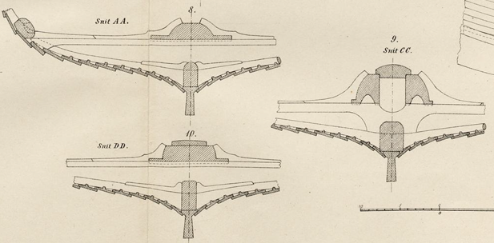

**_keel_** (English); _køl_ (Danish); _Kiel_ (German)

**_kjǫlr, kelr_** m., pl. _kilir_ (Old Norse) [citations: [prose](https://onp.ku.dk/onp/onp.php?o43782)/[poetry](https://lexiconpoeticum.org/m.php?p=lemma&i=45031)]  

  The carved longitudinal structure that forms the centerline at the bottom of the hull and was the first piece constructed for a Viking longship.  

  
    
  Longitudinal section of the keel from the Gokstad ship (Nicolaysen Pl. I, Fig. 4)
  
    
  Cross section of the keel from the Gokstad ship (Nicolaysen Pl. II, Figs. 8, 9, and 10)

  The keel is the spine of the ship, which on a Viking longship was usually around 50 to 60 feet in length. It would be ideal for the keel to be carved from a single trunk of an oak tree, as this would give the keel greater strength, though keels for large ships may have been pieced together and joined with rivets. Boatbuilders used specialized axes, as well as hammers, mallets, drills, biles, planers and scrapers, to cut and shape the wood. 
  
  The keel had a T shape to accept the strakes, or wooden planks, that formed the hull (ON _húfr_). The rest of the ship would be built up from this central piece.
  
---

  Nicolaysen, N. (1882). _Langskibet fra Gokstad ved Sandefjord._ Kristiania.