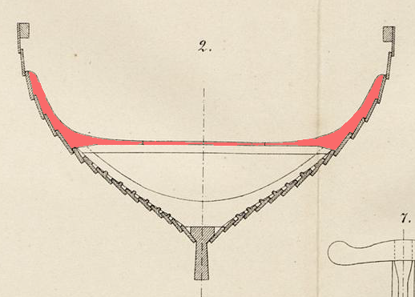

**_knee_** (English); _knæ_ (Danish); _Knie_ (German)

_unattested_ (Old Norse)

  Bracing angular timbers connecting beams to the upper strakes that also served as attachment points for rigging lines.  

  
    
  Cross section of the Gokstad ship showing the knees above the _biti_ (Nicolaysen Pl. II, Fig. 2)

  Formed of naturally forked wood for strength, the  knees connect the horizontal _bitis_ or other thwart beams to the upper rows of strakes above the water line (Sørensen 16). Knees were also important for sailing a Viking ship, since they often had attachment points for the lines of the rigging. On the Oseberg ship, the backside of all the knees had semi-circular cutouts with beveled edges, which reconstructions have proven work well for attaching ropes and controlling the sail (Bischoff 182).

---

  Bischoff, Vibeke. _The Oseberg Ship: Reconstruction of Form and Function_. Ships & Boats of the North, Volume 9. Roskilde: Viking Ship Museum, 2023.

  Nicolaysen, N. (1882). _Langskibet fra Gokstad ved Sandefjord._ Kristiania.

  Sørensen, Anne C. _Ladby: A Danish Ship-Grave from the Viking Age._ Ships and Boats of the North 3. Roskilde: The Viking Ship Museum [u.a.], 2001.

