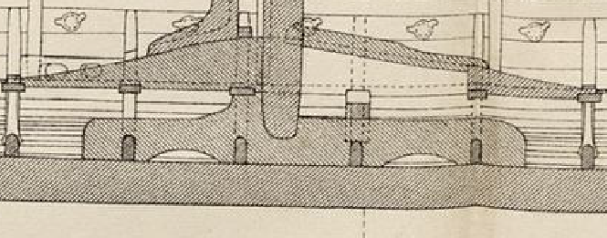

**_mast fish_** (English); _mastefisk_ (Danish); _Mastfisch_ (German)

_**klofi** m., pl. klofar_ (Old Norse - probable) [citations: [prose](https://onp.ku.dk/onp/onp.php?o44117)/[poetry](https://lexiconpoeticum.org/m.php?p=lemma&i=45381)]

  A large mass of wood that was placed on the keelson (ON _kerling_) to keep the mast upright and absorb stress while the ship was under sail. 

  
    
  Mast fish from the Gokstad ship (Nicolaysen Pl. I, Fig. 4). The mast fish sits above the keelson.

 
The mast fish was typically ten feet long and faced aft to help while the mast (ON _siglutré_, _sigla_) was raised (National Geographic). This feature is named for its fish-like shape, though it is sometimes also called the mast support or mast-partner (Nicolaysen). 

---

  Nicolaysen, N. (1882). Langskibet fra Gokstad ved Sandefjord. Kristiania.

   “The Realm of the Vikings.” _National Geographic._ Accessed December 5, 2024. https://www.nationalgeographic.com/specialprojects/interactive-assets/nggraphics/vikings-gfx/build-2017-02-24_14-15-56/.
