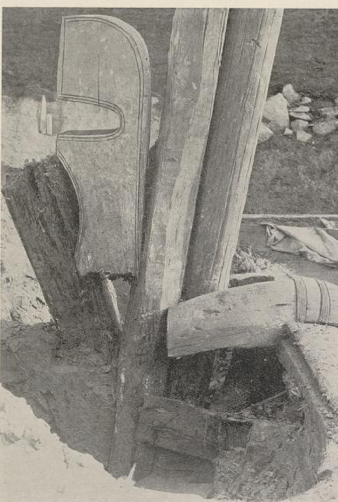

**_mast_** (English); _mast_ (Danish); _Mast_ (German)

_**sigla** f., siglu-tré, n._ (Old Norse) [citations: [prose](https://onp.ku.dk/onp/onp.php?o68379)/[poetry](https://lexiconpoeticum.org/m.php?p=lemma&i=71792)]  

_**vöndr** m., pl. vendr_ (Old Norse) [citations: [prose](https://onp.ku.dk/onp/onp.php?o88498)/[poetry](https://lexiconpoeticum.org/m.php?p=lemma&i=95470)]

  A long wooden pole that rises vertically from the ship and supports the sails.

  
    
  Mast from the Oseberg ship (Brøgger Pg. 286, Fig. 96)

  The rectangular viking sail was raised onto the mast and supported along its upper edge by a yard, this was used to replace or augment the effort of the rowers. The largest Viking ships could have a mast more than 70-feet long. Masts were also said to bend during heavy storms and wind due to the height (Jesch, 160). 
---

  Jesch, Judith. _Ships and Men in the Late Viking Age: The Vocabulary of Runic Inscriptions and Skaldic Verse._ NED-New edition. Woodbridge, Suffolk, UK ; Rochester, NY: 
  Brøgger, Anton W., and Arne Emil Christensen. Osebergfundet. Kristiania: Univ. Oldsaksamling, 1917. 

