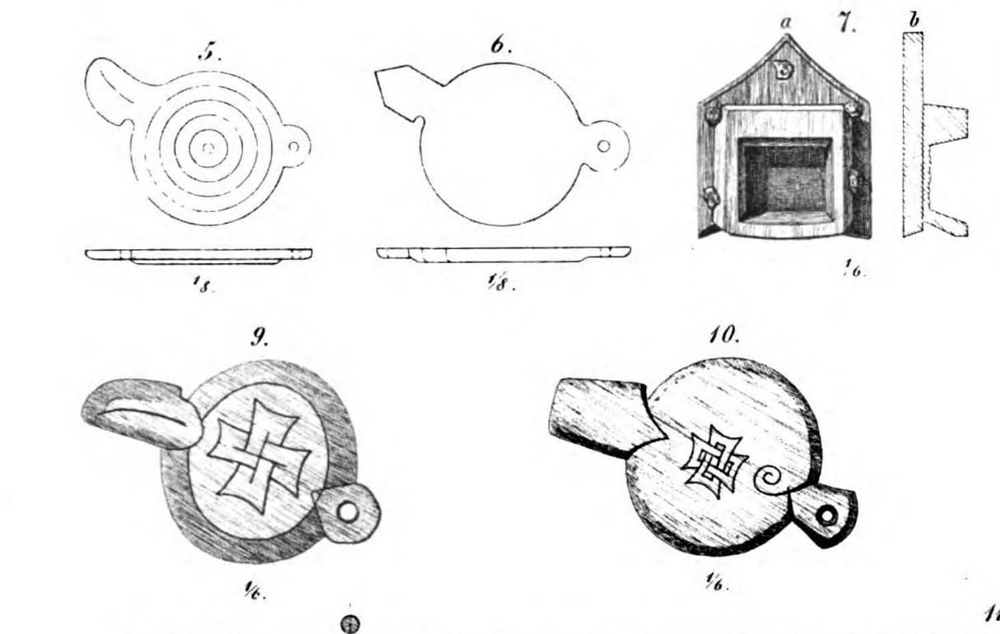

**_oarhole-lock_** (English); _årehulslukke_ (Danish); _Riemenlochverschluss_ (German)

_unattested_ (Old Norse)

  A small wooden device used to close the oarholes when not in use to prevent the ship taking on water.     

  
    
  Ornamented oarhole-locks from the Gokstad ship with pivot holes and a slit to receive a locking pin. (Crumlin-Pedersen, 1996, Figure 5.28, p127)

  The exact shape and function of oarhole-locks varies between ship finds: those at Hedeby are simple plugs, while the locks from Gokstad pivoted and latched on pins driven into the hull on either side of the hole (Nicolaysen 59). Oarhole-locks may have "belonged" to each rower, as many were personalised with carved decorations (Crumlin-Petersen 126).     

---

  Nicolaysen, N. _Langskibet fra Gokstad ved Sandefjord_. Kristiania: Alb. Cammermeyer, 1882. 

  Crumlin-Pedersen, Ole. 1996. _Viking-Age Ships and Shipbuilding in Hedeby._ Illustrated edition. Roskilde: Viking Ship Museum.

