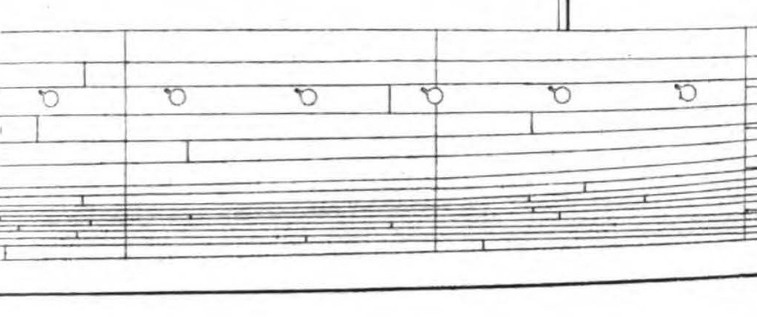
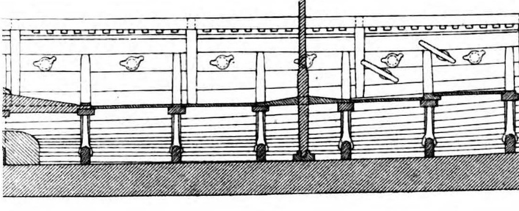

**_oarhole, oarport_** (English); _årehul_ (Danish); _Riemenloch_ (German)

_**hár** f., pl. háir_ (Old Norse) [citation: [prose](https://onp.ku.dk/onp/onp.php?o31447)/[poetry](https://lexiconpoeticum.org/m.php?p=lemma&i=31978)]     
_**hamla** f., pl. hǫmlur_ (Old Norse) [citation: [prose](https://onp.ku.dk/onp/onp.php?o31115)/[poetry](https://lexiconpoeticum.org/m.php?p=lemma&i=31626)]   

  Holes through an upper strake of the hull that acted as fulcrums for rowing the oars of a Viking ship.

  
    
  Reconstruction drawing of a section of the upper strakes and oarports of the Gokstad ship from the exterior (Nicolaysen Pl. I, Fig. 1).

    
  Interior of the same portion of the Gokstad ship, showing each oarhole centered in a "room" (Nicolaysen Pl. I, Fig. 4).

Ships needed high sides to keep out waves at sea, so oars were put through holes in an upper strake rather than rowlocks atop the gunwale used in smaller boats (Crumlin-Pedersen 128). The number of oarholes, and therefore oarsmen, determined the size of a ship's company, and taxes were often levied based on the amount of oarports present on a ship (Jesch 156).
         

---

  Jesch, Judith. _Ships and Men in the Late Viking Age: The Vocabulary of Runic Inscriptions and Skaldic Verse._ NED-New edition. Woodbridge, Suffolk, UK ; Rochester, NY: 
Boydell & Brewer, 2001. https://www.jstor.org/stable/10.7722/j.ctt163tb4f.

  Crumlin-Pedersen, Ole. 1996. _Viking-Age Ships and Shipbuilding in Hedeby._ Illustrated edition. Roskilde: Viking Ship Museum.

