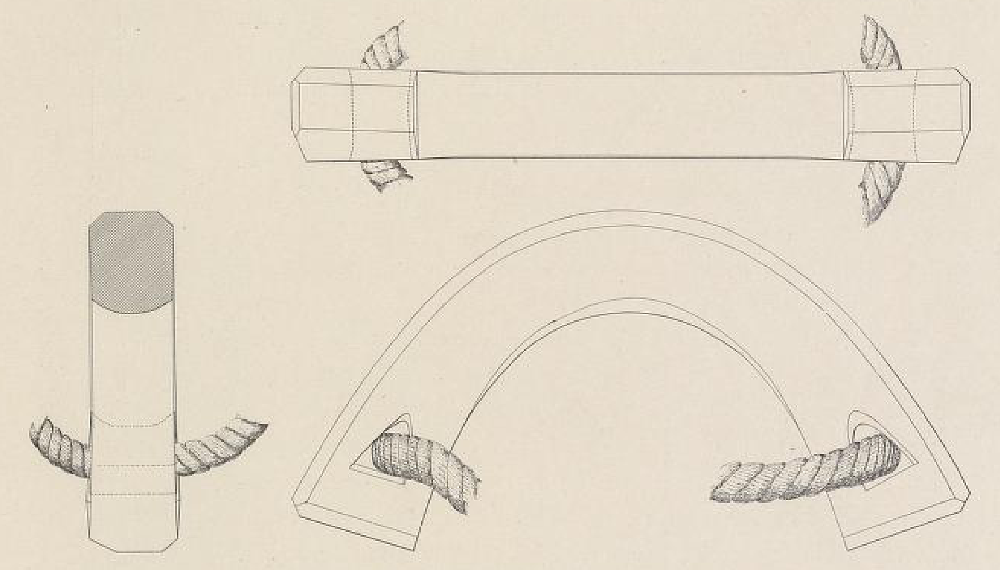

**_parrel_** (English); _rakke_ (Danish); _racke_ (German)

_**rakki** m._(Old Norse) [citations: [prose](https://onp.ku.dk/onp/onp.php?c514861)/[poetry](https://lexiconpoeticum.org/m.php?p=lemma&i=66385)]

  A curved or semi-circular piece of wood that connects the yard to the mast and allows the sail to slide up and down.

  
    
  Parrel from Oseberg Ship (Brøgger Fig. 121)

  A wooden parrel is tied to the middle part of the yard around the mast when the sail is in use and untied when the sail is taken down. The parrel found with the Oseberg ship had a triangular hole for separate lashings to the yard at either end, although its proper function was not recognized at the time (Brøgger et al 321; Bischoff 21).  

---  

  Bischoff, Vibeke. “Viking-Age Sails: Form and Proportion.” _Journal of Maritime Archaeology_ 12, no. 1 (2017): 1–24. https://doi.org/10.1007/s11457-016-9167-2.

  Brøgger, A. W., Hjalmar Falk, and Haakon Shetelig. _Osebergfundet. 1._ Kristiania: Universitetets Oldsaksamling, 1917. https://urn.nb.no/URN:NBN:no-nb_digibok_2019111248002.

