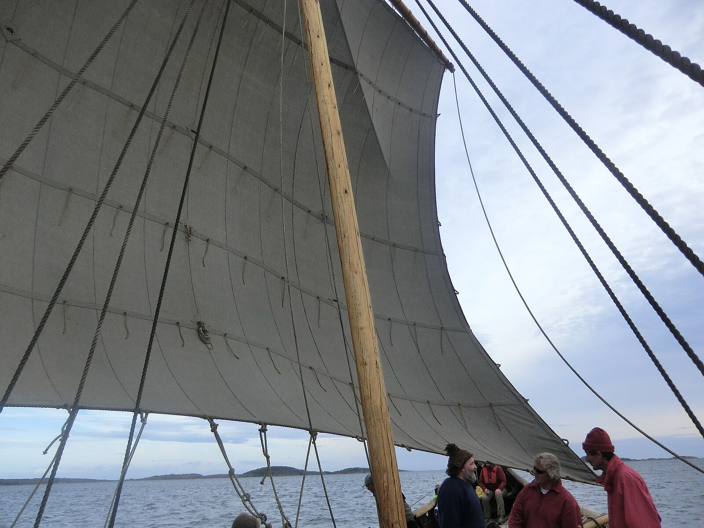

**_reef_** (English); _ribben_ (Danish); _Rippe_ (German)

_**rif**_ n., (Old Norse) [citations: [prose](https://onp.ku.dk/onp/onp.php?o64925)/[poetry](https://lexiconpoeticum.org/m.php?p=lemma&i=68028)]  

  Reefs, or reef-points, are lengths of rope sewn to a sail used to adjust the area depending on wind conditions. Reefing the sail is done by rolling a part of the sail inward and tying it to temporarily reduce the area exposed to the wind.   

  
  

Reef-points visible on the sail of a recreated Viking Ship (ruud.trygve@gmail.co…, CC BY 3.0, via Wikimedia Commons)

  In connection with hard winds, the sail of a ship can be reefed, or reduced in size, to slow the ship or ensure that it does not heel over. Reefing can be done in advance from the top of the sail. If done while sailing, the sail can more easily be reefed from the loose footed bottom (Gersbøll). 

---

  Bischoff, Vibeke. “Viking-Age Sails: Form and Proportion.” Journal of Maritime Archaeology 12, no. 1 (2017): 1–24. http://www.jstor.org/stable/44508681.

  Gersbøll, Poul and Tajs Køngerskov. _Reefing_ The Voyage of 2007. - Vikingeskibs Museet (2007).

  ruud.trygve@gmail.co…, _Nøtterøy, Norway_, CC BY 3.0, via Wikimedia Commons
