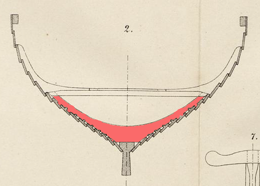

**_rib_** (English); _planke_ (Danish); _Planke_ (German)

**_rǫng_** f., pl. _rengr_ (Old Norse) [citations: [prose](https://onp.ku.dk/onp/onp.php?o65992)/[poetry](https://lexiconpoeticum.org/m.php?p=lemma&i=69180)]  

  Lateral structural members that reinforce the strakes inside the ship from the keel to the waterline.  

  
    
  Cross section of the Gokstad ship showing the rib, with strakes attached, resting on the keel (Nicolaysen Pl. II, Fig. 2)

  In clinker-built construction, the interior ribs were added only after the strakes reached the desired height. Ribs stiffen the hull transversely and ensure that the ship maintains the correct form. Viking boat builders used a spacing of roughly 850-950 mm (33-37  inches) between ribs to achieve the correct distance between rowing stations and to create space for the sea chests, which were used by sailors as seats (ON _sess_) while rowing the boat (Crumlin-Pedersen 141-2). The ribs were individually hewn and shaped from naturally forked timbers so as to ensure a tight fit with the strakes.

---

  Nicolaysen, N. (1882). _Langskibet fra Gokstad ved Sandefjord._ Kristiania.

  Crumlin-Pedersen, Ole. _Viking-Age Ships and Shipbuilding in Hedeby._ Illustrated edition. Roskilde: Viking Ship Museum, 1996.
