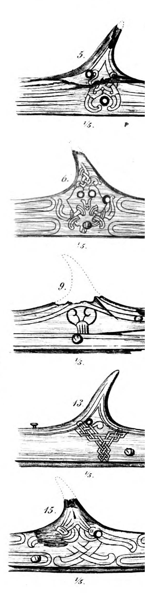

**_rowlock_** (English); _åretol_ (Danish); _Riemendolle_ (German)

_**keipr** m., pl. keipar_ (Old Norse) [citations: [prose](https://onp.ku.dk/onp/onp.php?o42936)/[poetry](https://lexiconpoeticum.org/m.php?p=lemma&i=44158)]  

Pins on the upper edge of boats’ sides, which allowed for rowing and for oars to be rested. 

  
  
  
  rocklocks from the Gokstad ship (Nicolaysen Pl. V, Fig. 5,6,9,13,15,)

The various methods of mounting rowlocks were probably primarily determined by the thickness of the ships’ sheerstrakes (Crumlin-Pedersen, 126). 

---

  Jesch, Judith. _Ships and Men in the Late Viking Age: The Vocabulary of Runic Inscriptions and Skaldic Verse._ NED-New edition. Woodbridge, Suffolk, UK ; Rochester, NY: 
Boydell & Brewer, 2001. https://www.jstor.org/stable/10.7722/j.ctt163tb4f.

  Crumlin-Pedersen, Ole. 1996. _Viking-Age Ships and Shipbuilding in Hedeby._ Illustrated edition. Roskilde: Viking Ship Museum.
