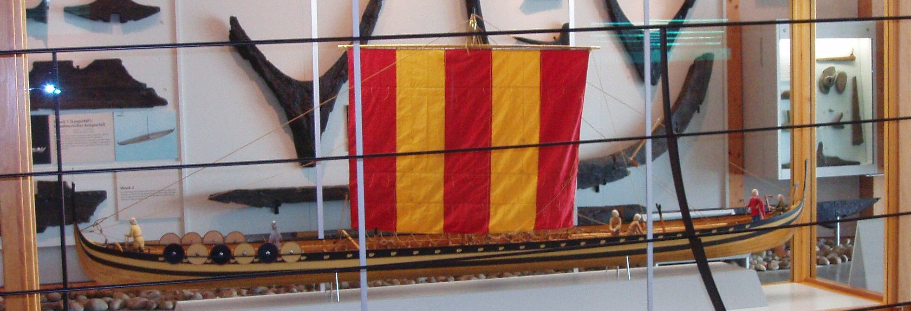

**_sail_** (English); _sejl_ (Danish); _Segel_ (German)

_**segl** n._ (Old Norse) [citations: [prose](https://onp.ku.dk/onp/onp.php?o67610)/[poetry](https://lexiconpoeticum.org/m.php?p=lemma&i=70952)]  

  A large piece of cloth tied to a yard (ON _rá_) hung from the mast (ON _sigla_) to propel the ship by catching and directing wind. 

  

  Model of the Hedeby 'Wreck 1' warship from the *Wikinger Museum Haithabu*, showing a symmetrical square-rigged sail made from vertical strips of cloth (Xocolatl, via Wikimedia Commons)
  

  Viking Age ships were square-rigged, with symmetrical square sails hung perpendicular to both mast and keel. Iconographic sources and experimental reconstructions of archaeological finds have shown that the width of sails was just under half the length of the ship (Bischoff, 157). They were most often made from wool woven in strips that were sown together vertically and then smeared with tallow or other fats (Bischoff, 164-5; Cooke and Christiansen, 73). 

---
  
  Bischoff, Vibeke. _The Oseberg Ship: Reconstruction of Form and Function_. Ships & Boats of the North, Volume 9. Roskilde: Viking Ship Museum, 2023.
  
  Cooke, Bill, and Carol Christiansen. “What Makes a Viking Sail?” In _Northern Archaeological Textiles_, edited by Frances Pritchard and John Peter Wild, 70–74. Oxbow Books, 2005.

  Xocolatl, "Modell des Wikingerlangschiffs in Haithabu", Public domain, via Wikimedia Commons, 2008.