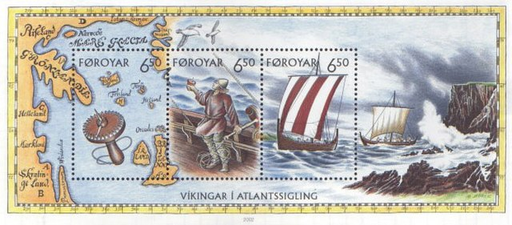

**_sail_** (English); _sejle_ (Danish); _Segel_ (German)

_**segl** n._ (Old Norse) [citations: [prose](https://onp.ku.dk/onp/onp.php?o67610)/[poetry](https://lexiconpoeticum.org/m.php?p=lemma&i=70952)]  

  A large typically square sail (segl) made out of cloth using wool materials. The sail (segl) allows the viking ship to be propelled by the wind, helping out the oars (árar).    

  

  Model of Oseberg Ship Sail (Vikingeskibshallen)

  
  Viking Ship Sail Depicted in Art (Martin Mörck)

  Sails were not used in early type Viking ships but were developed for long voyages. The Viking ship could not have accomplished what it did in respect to travel over long distances and in raiding operations without sails (Bruun, Per). Sails enable Vikings to rely on stable winds as well as rowing, proving for a less tiring travel (Cooke, Bill).    

---
   Cooke, Bill, and Carol Christiansen. “What Makes a Viking Sail?” In Northern Archaeological Textiles, edited by Frances Pritchard and John 
Peter Wild, 70–74. Oxbow Books, 2005.

 Mörck, Martin. "Faroe Stamp Sheet." Wikipedia Commons: 2002
 
  
  Oseberg Ship: Model. c.825. Oak and beechwood, l. 65’. Vikingeskibshallen (Roskilde, Denmark).
 
  Per Bruun. “The Viking Ship.” Journal of Coastal Research 13, no. 4 (1997): 1282–89.
  
  Cooke, Bill, and Carol Christiansen. “What Makes a Viking Sail?” In Northern Archaeological Textiles, edited by Frances Pritchard and John 
Peter Wild, 70–74. Oxbow Books, 2005.

  
