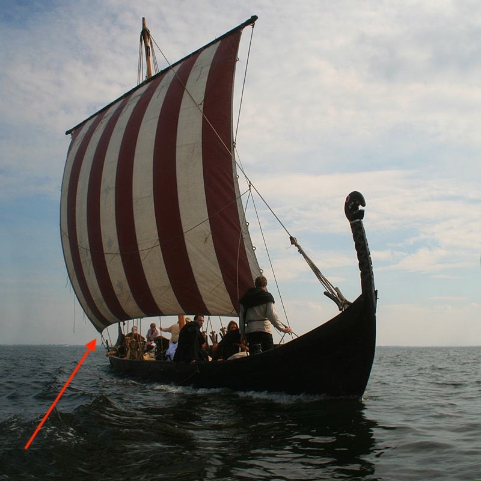

**_sheet_** (English); _skøde_ (Danish); _Schot_ (German)

_**skaut** n._ (Old Norse) [citations: [prose](https://onp.ku.dk/onp/onp.php?o69986)/[poetry](https://lexiconpoeticum.org/m.php?p=lemma&i=73548)]  
_**skaut-reip** n._ (Old Norse) [citations: [prose](https://onp.ku.dk/onp/onp.php?o69999)/[poetry](https://lexiconpoeticum.org/gefin/q.php?p=lp/words/word/73563)]  

  Sheet (ON _skaut_) refers to the corner of a square sail or other object, and by extension to the lines attached to the lower sail corners (more literally ON _skaut-reip_) that control the angle of the sail in relation to the wind. 

  
    
  The arrow indicates the sheet on the reconstructed Viking ship Sebbe Als of Augustenborg, Denmark under sail (Steen Weile).

  Sheets and other rigging lines were typically made of horse hair (Gislinge Boat Project), and secured fore and aft with clamps or belaying pins (Bischoff, 4-8).

---

  Bischoff, Vibeke. “Viking-Age Sails: Form and Proportion.” Journal of Maritime Archaeology 12, no. 1 (2017): 1–24. http://www.jstor.org/stable/44508681.

  Gislinge Boat Open Source Project 2015. “Rope.” Vikingeskibsmuseet, 2015. https://www.vikingeskibsmuseet.dk/en/professions/boatyard/building-projects/gislingeboat-2015/rope.

  Steen Weile, Notmark, Denmark, Viking ship Sebbe Als of Augustenborg, Denmark under sail. CC BY 3.0, via Wikimedia Commons