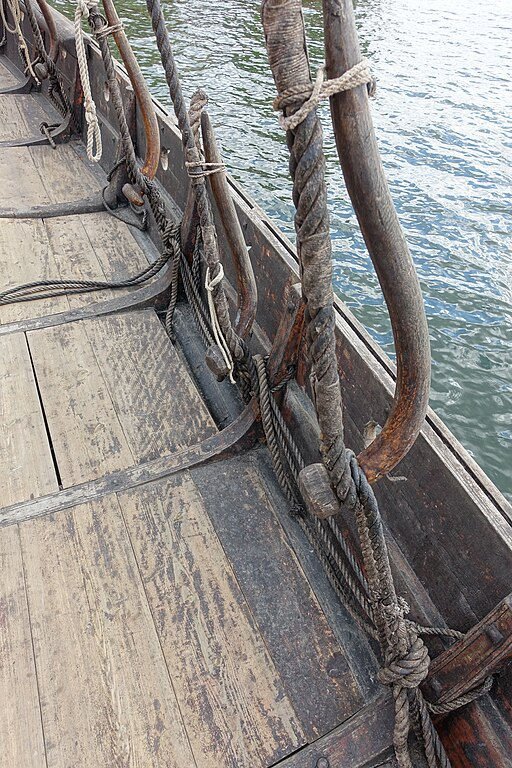

**_shroud_** (English); _vant_ (Danish); _Want_ (German)  
**_shroud-pin_** (English); _vantnål_ (Danish); _Wantnadel, Wantenspanner_ (German)

_**höfuðbenda** f., pl. höfuðbendur_ (Old Norse) [citations:[prose](https://onp.ku.dk/onp/onp.php?o39309)/[poetry](https://lexiconpoeticum.org/m.php?p=lemma&i=40452)]

A rope or cable that supports the mast from either side, connected to a shroud-ring in the hull by a shroud-pin: a curved wooden pin which could be loosened quickly to lower the mast. 

  
    
  Shroud-pins fastening shrouds on the replica Saga Oseberg ship. (Wolfmann, CC BY-SA 4.0, via Wikimedia Commons)

The standing rigging (ON _skrúð_) of Viking ships typically steadied the mast with a stay lashed to the forestem, and two or more shrouds connected to the hull on each side. The shrouds would need to be loosened in a hurry to lower the mast in order to pass under bridges, and the shroud-pin could be slipped out of the shroud-ring to quickly loosen the supporting ropes (Nicolaysen 20). This may explain why the distinction between standing and running rigging (ON _reiði_) was less relevant in Old Norse vocabulary, since the mast was regularly raised and lowered just like the sail (Jesch 165).  

---

Jesch, Judith. _Ships and Men in the Late Viking Age: The Vocabulary of Runic Inscriptions and Skaldic Verse._ NED-New edition. Woodbridge, Suffolk, UK ; Rochester, NY: 
Boydell & Brewer, 2001. https://www.jstor.org/stable/10.7722/j.ctt163tb4f.

Nicolaysen, N. _Langskibet fra Gokstad ved Sandefjord_. Kristiania: Alb. Cammermeyer, 1882.

Wolfmann, _Saga Oseberg Details shroud-pins or vantnales to secure the shrouds to the hull, gunwale, oarholes, knees, deck etc Viking ship replica 2012 Tønsberg harbour Norway 2019-08-16 04307.jpg,_ CC BY-SA 4.0, via Wikimedia Commons. 
