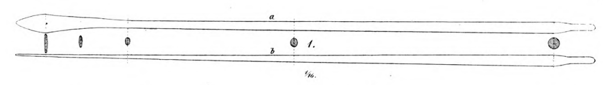

**_shroud_** (English); _vant_ (Danish); _Want_ (German)

not to be confused with hofubendur which means 'backstays'. 
_**höfuðbenda** f., pl. repword_ (Old Norse) [citations: [prose](https://onp.ku.dk/onp/onp.php?o39309)/[poetry](https://lexiconpoeticum.org/m.php?p=lemma&i=4453)]  --> cannot find the poetry definition! 

A rope or cable that supports the mast from either side. 

  
    
  Oar from the Gokstad ship (Nicolaysen Pl. V, Fig. 1)

  
Typically, boats would contain a mast steadied by a stay lashed to the forepost, and two to three shrounds on each side of the post. (Nicholayson 20)

---

  Jesch, Judith. _Ships and Men in the Late Viking Age: The Vocabulary of Runic Inscriptions and Skaldic Verse._ NED-New edition. Woodbridge, Suffolk, UK ; Rochester, NY: 
Boydell & Brewer, 2001. https://www.jstor.org/stable/10.7722/j.ctt163tb4f.

  Crumlin-Pedersen, Ole. 1996. _Viking-Age Ships and Shipbuilding in Hedeby._ Illustrated edition. Roskilde: Viking Ship Museum.
