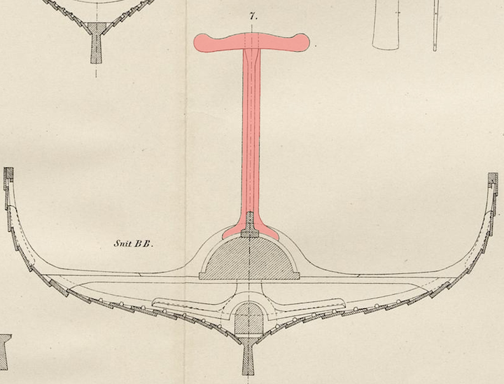

**_stanchion_** (English); _støtte_ (Danish); _Stütze_ (German)

**_stuðill_** m., pl. _stuðlar_ (Old Norse) [citations: [prose](https://onp.ku.dk/onp/onp.php?o76391)/[poetry](https://lexiconpoeticum.org/m.php?p=lemma&i=80370)]  

  Upright support that stands proud of the deck to hold the yard, when the sail is furled, or possibly other spars or oars.

  
    
  Cross section of the Gokstad ship showing the central stanchion resting on the mastfish (Nicolaysen Pl. II, Fig. 7)

  The Gokstad ship had three upright stanchions running down the center line, each topped by a cross beam with semi-circular depressions to hold spars. The fore and aft stanchions are stepped into the bottom of the ship and pass through a small fish shaped block so they can be removed when not needed. The central stanchion is secured directly to the mast fish with a tripod-like structure (Nicolaysen 55). 

---

  Nicolaysen, N. (1882). _Langskibet fra Gokstad ved Sandefjord._ Kristiania.