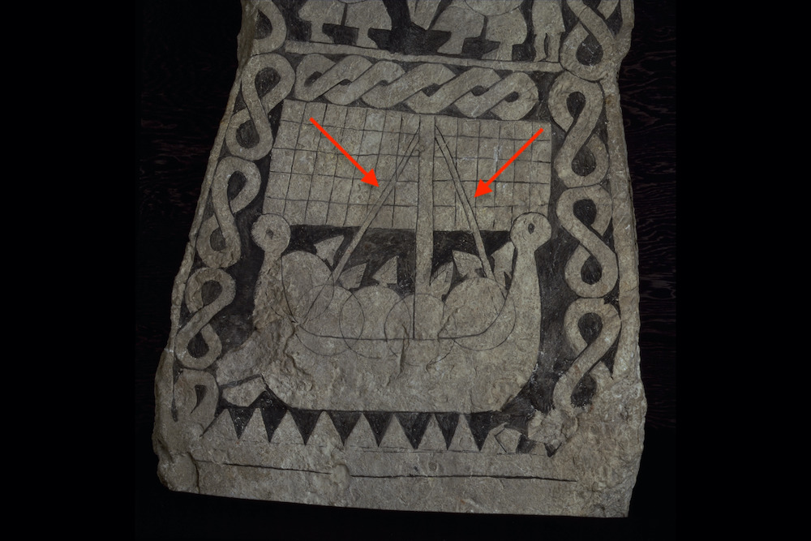

**_stay_** (English); _stag_ (Danish); _Stag_ (German)

_**stag** n., pl. stög_ (Old Norse) [citations: [prose](https://onp.ku.dk/onp/onp.php?o74925)/[poetry](https://lexiconpoeticum.org/m.php?p=lemma&i=78815)]  

A strong rope supporting the mast by connecting the top of the mast to a stem of the hull. The stays support the  mast forward and aft, while the shrouds support it from side to side. 

  
    
  Example of the stay holding the mast up on a ship. 

  Stays were critical components of the standing rigging that kept the mast upright under pressure on the sail during high winds. They were fixed around the top of the mast above the hole for the halyard, and slanted down at a characteristically sharp angle, captured in the phrase "leaning like a stay" found in Skaldic verses (Nicolaysen 20; Jesch 165). 
  
---

  Jesch, Judith. _Ships and Men in the Late Viking Age: The Vocabulary of Runic Inscriptions and Skaldic Verse._ NED-New edition. Woodbridge, Suffolk, UK ; Rochester, NY: 
Boydell & Brewer, 2001. https://www.jstor.org/stable/10.7722/j.ctt163tb4f.

 Smith , Cathy. Shrouds and Stays. Photograph. Erie, PA, September 8, 2016. Erie, PA. 

 N. Nicolaysen, Langskibet fra Gokstad ved Sandefjord (Kristiania: Alb. Cammermeyer, 1882).
