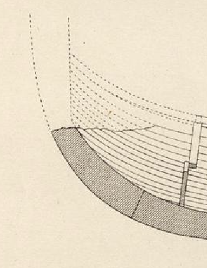
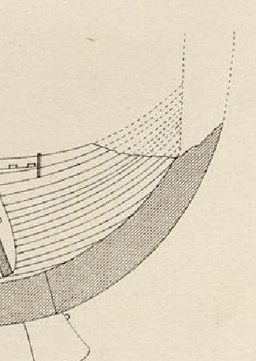

**_stem_** (English); _stævn_ (Danish); _Steven_ (German)

**_stafn_** m., pl. _stafnar_ (Old Norse) [citations: [prose](https://onp.ku.dk/onp/onp.php?o74866)/[poetry](https://lexiconpoeticum.org/m.php?p=lemma&i=78753)]  

  A vertical extension of the keel above the waterline fore and aft. Viking ships have characteristically symmetrical stems at both prow and stern, sometimes elaborately decorated with dragon heads.

  
    
  Fore-stem of the Gokstad ship (Nicolaysen Pl. I, Fig. 1)

    
  After-stem of the Gokstad ship (Nicolaysen Pl. I, Fig. 1)

  Stems were hewn from a single piece of curved oak wood. The stems on this ship are rabbeted, shaped as simple curves with notches hewn into the backside where rivets join the strakes to the stem. Stems on other Viking ships can be more complex and are carved with notched steps to receive the strakes (Sørensen 17). Although more difficult to carve, this type of stem eventually saves construction time as it does not require the strakes to be cut into complex shapes for them to be joined to the stem.

---
  
  Nicolaysen, N. (1882). _Langskibet fra Gokstad ved Sandefjord._ Kristiania.

  Sørensen, Anne C. _Ladby: A Danish Ship-Grave from the Viking Age._ Ships and Boats of the North 3. Roskilde: The Viking Ship Museum [u.a.], 2001.
