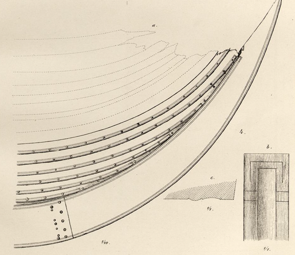
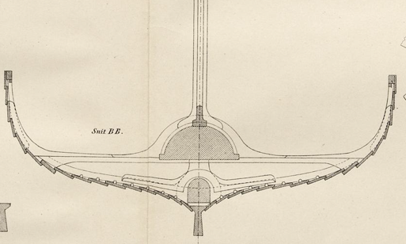

**_strake_** (English); _planke_ (Danish); _Planke_ (German)

**_súð_** f., pl. _súðir_ (Old Norse) [citations: [prose](https://onp.ku.dk/onp/onp.php?o76716)/[poetry](https://lexiconpoeticum.org/m.php?p=lemma&i=78753)]  
**_borð_** n., pl. _borð_ (Old Norse) [citations: [prose](https://onp.ku.dk/onp/onp.php?o10067)/[poetry](https://lexiconpoeticum.org/m.php?p=lemma&i=10044)]  

   Strakes are a continuous line of planking from the stem to the stern of a ship.    

  
     
   Strakes on the Gokstad ship with stem and transition piece (Nicolaysen Pl. III, Fig. 4)
   
     
   Cross section of the Gokstad ship amidship, showing the clinker-built construction of the hull (Nicolaysen Pl. II, Fig. 7)

   Strakes are made up of overlapping wooden planks that extend up and out from the keel to form the sides of the ship. This joining of strakes is 
   called _skǫr_ (f., pl. _skarar_; Old Norse). Strakes were riven, or radially hewn, so that the wood grain is at right angles to the surface of 
   the plank. This made the wood more flexible and stronger, and allowed for even expansion and contraction in water. The strakes overlapped by 
   25-30 mm (roughly one inch) and were held in place using iron rivets in what is now referred to as “clinker-built” or lapstrake construction. 
   Each overlap was stuffed with wool or animal hair or sometimes hemp soaked in pine tar to ensure water tightness. This type of construction allows 
   the ship’s hull to flex as it moves through the water and provides additional longitudinal strength to it.

---

   Nicolaysen, N. (1882). _Langskibet fra Gokstad ved Sandefjord._ Kristiania.