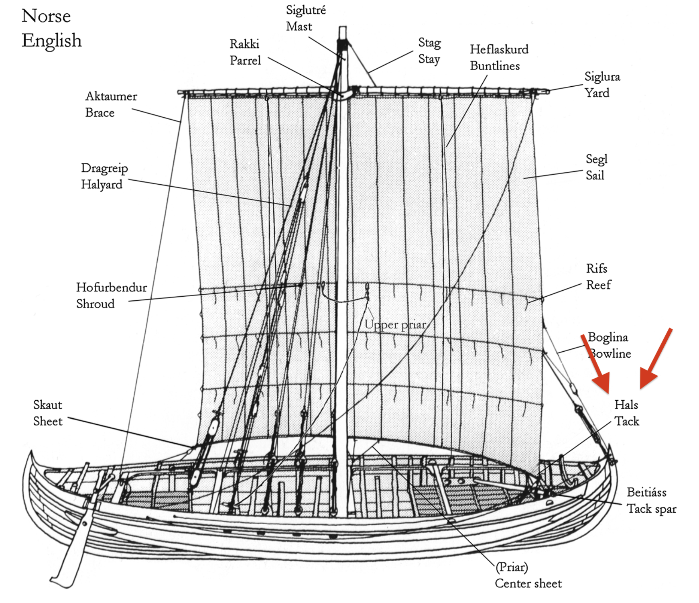

**_tack_** (English); _Wende_ (German)

_**hals** m., pl. halsar_ (Old Norse) [citations: [prose](https://onp.ku.dk/onp/onp.php?o30985)/[poetry](https://onp.ku.dk/onp/onp.php?o30985)]  

  The lowest corner of the front of the sail which is secured to the hull when changing direction (tacking) or when the wind is coming from behind the ship at a significant angle.

  
    
  Tack from the Skuldelev 1 Ship (Bischoff 2017, p. 3) 
  

  
  The tack was an important part of the Viking sail to which ropes were attached to manuever the ship and control the sail in harsh wind conditions. It is known that the tack was often fastened to holes on the side of the hull either by clamps or belaying pins (Bischoff 8).   

---
  Vibeke Bischoff, “Viking-Age Sails: Form and Proportion,” Journal of Maritime Archaeology 12, no. 1 (2017): 1–24, https://doi.org/10.1007/s11457-016-9167-2.

  David Renouf, “Thames Sailing Barges - Glossary,” October 23, 2016, https://web.archive.org/web/20161023140442/http://www.thamesbarge.org.uk/barges/bargeglossary.html.

  OED: tack, n.1, II., 5.a.
