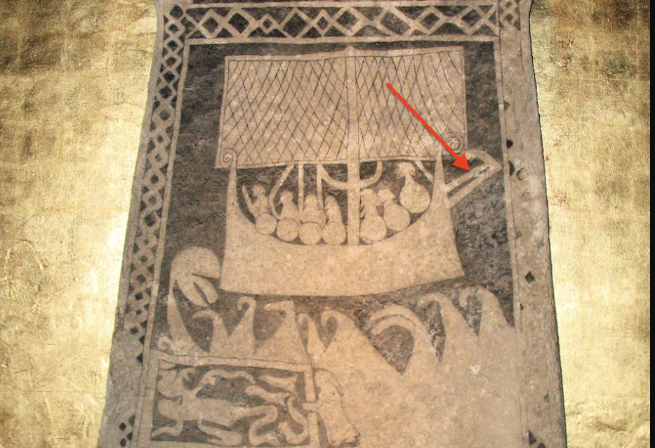

**_tacking spar_** (English); _stagbommen_ (Danish); _Wendenspiere_ (German)  
**_spar_** (English); _spir_ (Danish); _Spiere_ (German)

_**beitiáss** m., pl. beitiásar_ (Old Norse) [citations: [prose](https://onp.ku.dk/onp/onp.php?o7639)/[poetry](https://lexiconpoeticum.org/m.php?p=lemma&i=7957)]  

 A spar (ON *áss*) attached to the bottom foremost corner of a square sail to keep it strained when beating against the wind or tacking.     

  
  
  The _beitiáss_ in use on the Hunninge picture stone from Gotland (Berig, CC BY-SA 4.0, via Wikimedia Commons)

  Moving the tacking spar angles the sail, allowing the ship to tack into the wind (Hale 1998, 62). Its use reduces strain on the side of a ship by distributing the pressure from the sail over to the opposite side, where the forces can be spread over several frames (Bischoff 2017, 2). The use of the _beitiáss_ is known from written sources like the kings' sagas, iconographic sources like the Gotland picture stones, and from ethnographic boat traditions from northwestern Iceland (Bischoff 2017, 6).

---

  Bischoff, Vibeke. “Viking-Age Sails: Form and Proportion.” Journal of Maritime Archaeology 12, no. 1 (2017): 1–24. 
 
  Hale, John R. “The Viking Longship.” Scientific American 278, no. 2 (1998): 56–63.
  
  Berig, _Hunninge picture stone_, CC BY-SA 4.0, via Wikimedia Commons.
