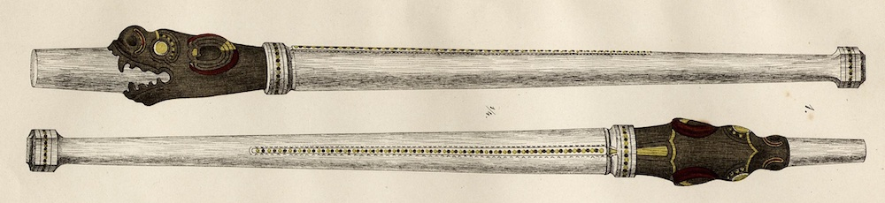

  
**_tiller_** (English); _rorpind_ (Danish); _Ruderpinne_ (German)

_**hjalm-vǫlr / hjǫlmunvǫlr** m._ (Old Norse) [citations: [prose](https://onp.ku.dk/onp/onp.php?o34638)/[poetry](https://lexiconpoeticum.org/m.php?p=lemma&i=35728)]  

  A wooden lever attached at right angles to the top of the rudder, used by the helmsman to steer a ship. 

  
    
  Elaborately decorated and carved tiller from the Gokstad ship (Nicolaysen Pl. XI, Fig. 1)

  The tiller was the primary means for steering a Viking ship; by pushing and pulling the tiller fore and aft the attached side rudder rotated laterally in the water. The ON verb _stýra_ literally means holding the tiller and directing the ship but is also used metaphorically in the corpus of Skaldic poetry to refer to a captain's command of one or more ships (Jesch 174). The importance of the tiller and helmsman position is indicated by the elaborate decoration of the Gokstad find, which was carved and painted in three colors, in contrast to the less decorated other parts of the ship (Nicolaysen 67-8).

---

  Jesch, Judith. _Ships and Men in the Late Viking Age: The Vocabulary of Runic Inscriptions and Skaldic Verse._ NED-New edition. Woodbridge, Suffolk, UK ; Rochester, NY: 
Boydell & Brewer, 2001. https://www.jstor.org/stable/10.7722/j.ctt163tb4f.

  Nicolaysen, N. _Langskibet fra Gokstad ved Sandefjord_. Kristiania: Alb. Cammermeyer, 1882.

