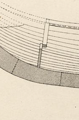
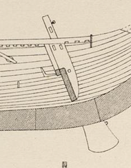

**_transition piece_** (English)

_**barð**_ n. (Old Norse) [citations: [prose](https://onp.ku.dk/onp/onp.php?o6937)/[poetry](https://lexiconpoeticum.org/m.php?p=lemma&i=7358)]  

  The transition pieces extend the horizontal keel to connect to the vertical stems.  

  
    
  Fore-transition piece of the Gokstad ship (Nicolaysen Pl. I, Fig. 4)
  
    
  After-transition piece of the Gokstad ship (Nicolaysen Pl. I, Fig. 4)

  Transition pieces connect the horizontal keel to the vertical stems. These pieces would be hewn from a single piece of wood, which boatbuilders would cut from large, curved branches of an oak tree. As the ship moves through the water, ice, or is beached, a single piece of wood provides more strength to a weaker area of the hull. These transition pieces would be attached by rivets to the stem and keel with a scarf joint. This joint is formed by cutting opposing tapered ends on each piece of wood, which are then fitted together with rivets.

---

  Nicolaysen, N. (1882). _Langskibet fra Gokstad ved Sandefjord._ Kristiania.