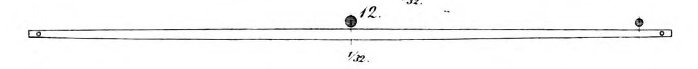

**_yard_** (English); _rå_ (Danish); _Rah_ (German)

_**rá/siglu-rá** f., pl. ráar_ (Old Norse) [citations: [[prose](https://onp.ku.dk/onp/onp.php?o63168)/[poetry](https://lexiconpoeticum.org/m.php?p=lemma&i=66095)]

A horizontal spar of wood hanging perpendicular to the mast from which the upper edge of the square sail is suspended. 

  
    
  Yard from the Gokstad ship (Nicolaysen Pl. IV, Fig. 12)

  The yard supported and kept the sail strained during winds and was raised and lowered by means of a halyard (ON _dragreip_). A brace rope was tied to each end of the yard (the yardarms) to allow the sail to be moved to any position the wind required (Nicolaysen, 20). The yard was one of the parts of the ship that was most vulnerable to damage in storms or hard weather. They were typically long, slender and made of fir or pinewood (Jesch, 162)
  
---

  Jesch, Judith. _Ships and Men in the Late Viking Age: The Vocabulary of Runic Inscriptions and Skaldic Verse._ NED-New edition. Woodbridge, Suffolk, UK ; Rochester, NY: Boydell & Brewer, 2001. https://www.jstor.org/stable/10.7722/j.ctt163tb4f.

  Nicolaysen, N. Langskibet fra Gokstad ved Sandefjord. Kristiania: Alb. Cammermeyer, 1882.

