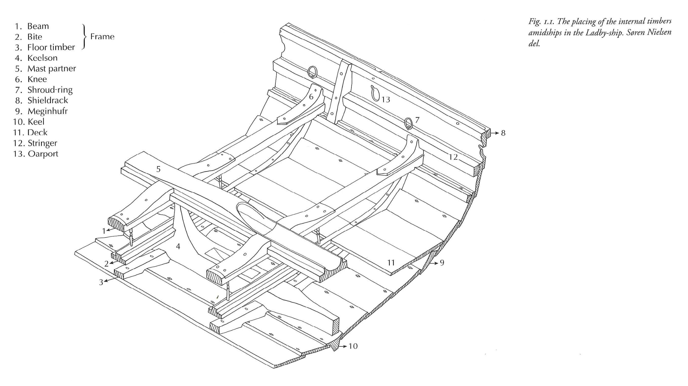

This folder contains images to be included in annotations. 

# Adding images

Upload images here following naming convention of `Object_FindSite.extension` e.g. 
```
Anchor_Ladby.png
Oar_Gokstad.png
Runestone_Tune.jpg
```

# Referencing images in annotations

In annotations, use relative links to reference images, navigating up from subfolders with two dots, e.g. `../images/Stems_Ladby.png` so the markdown to insert the image below might look like 
```

```


