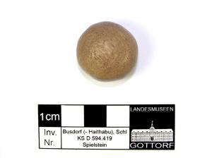

  
**Bone gaming piece**

  
_Spielstein aus Geweih_  
(SH1979-4.4813 Wikinger Museum Haithabu)

Board games, such as the strategic game _hnefatafl_, were a popular leisure time activity for all, made accessible through the basic objects used to play (Maixner, 66). Game pieces could be carved out of common materials, such as wood, antler, or bone, and a board made of simple squares could be easily cut onto a piece of wood (Schietzel, 287).

---

Birgit Maixner, _Haithabu - Fernhandelszentrum Zwischen Den Welten. Begleitband Zur Ausstellung Im Wikinger Museum Haithabu_, 3rd ed. (Archäologisches Landesmuseum. Schloss Gottorf, 2019).

Kurt Schietzel, _Unearthing Hedeby: An Archaeological Exploration of the Early Medieval Settlement of Hedeby: Documentation and Chronicle 1963-2013_, with Flemming Bau et al. (Wachholtz, 2022).
