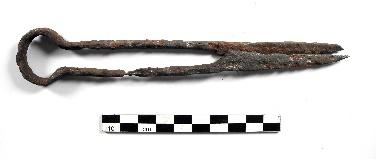

  
**Iron Shears**

  
_Bügelschere_  
(SH1901-1.243 Wikinger Museum Haithabu)

Iron was an essential material for the manufacturing of tools, weapons, and ships. Though a larger, similar shape of iron shears was likely used to shear sheep on land, the size of these portable shears suggests that they were used for beard trimming (Schietzel, 365, 284). Shears like these were also used to cut cloth and would have been valuable for sail repair (Schietzel, 366).

---

Kurt Schietzel, Unearthing Hedeby: An Archaeological Exploration of the Early Medieval Settlement of Hedeby: Documentation and Chronicle 1963-2013, with Flemming Bau et al. (Wachholtz, 2022).
