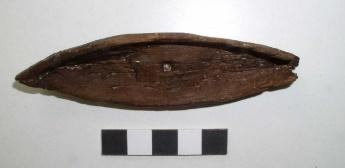

  
**Miniature ship**

  
_Miniaturschiff_  
(SH1979-4.3059 Wikinger Museum Haithabu)

Toy ships are recorded in Icelandic Sagas such as the Saga of Ref the Sly. As a child, a Norwegian friend gave Ref a toy boat, which Ref referenced as an adult to reportedly construct one of the greatest ships ever made (Smiley and Kellogg). A combined 15 model ships/boats, ranging from small and crude to large and sophisticated, have been recovered from Hedeby and Schleswig, highlighting the importance of ships in the Viking Age and their prevalence in everyday life (Crumlin-Pedersen, 169). While some were likely toys for children, especially those interested in building ships, they may have also been used in the home as candle holders or bowls, or for ceremonial purposes relating to fertility (Crumlin-Pedersen, 170-171). Especially important was their role as a model for shipwrights, allowing them to display their product to potential customers and measure out timber for a new vessel using the model as a scale, reminiscent of the story of Ref the Sly (Crumlin-Pedersen, 72).

---

Jane Smiley and Robert Kellogg, eds., _The Sagas of Icelanders: A Selection_, trans. Smiley, Jane and Kellogg, Robert (Viking, 2000), 603.

Ole Crumlin-Pedersen, _Viking-Age Ships and Shipbuilding in Hedeby_, Illustrated edition (Viking Ship Museum, 1996).
