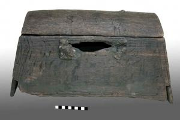

  
**Seachest**

  
_Seekiste_  
(SH1979-4.4804 Wikinger Museum Haithabu)

In 1979, an excavation team uncovered this chest in the mud of Hedeby harbor. Containing only a heavy stone, which pinned it to the sea floor for over 10 centuries, and with a fractured gap where the lock should have been, researchers speculated that the contents had been stolen and the evidence of the robbery disposed of (Crumlin-Pedersen, 141-142). With a design well aligned to various purposes, chests like these were an invaluable component of sea travel. Apart from its use to store personal belongings and necessities, its shape and lack of handles indicates employment as furniture, with particular use as a seat for oarsmen on vessels without thwarts (Schietzel, 226; Crumlin-Pedersen, 141). The trapezoidal design would have prevented the chest from tipping over when the ship heeled, and the vaulted lid would have well supported a seated man’s weight (Crumlin-Pedersen, 142). The wood for the chests was produced through the riving process, which involved splitting a log along its natural growth lines with a wedge, resulting in wooden planks of great integrity that didn’t warp as the wood expanded and contracted (Fox, 29).

---

Kate Fox, “Convergent Design: The Six-Board Viking Sea Chest,” _Mortise & Tenon Magazine_, no. 5 (September 2018): 24–32.

Kurt Schietzel, _Unearthing Hedeby: An Archaeological Exploration of the Early Medieval Settlement of Hedeby: Documentation and Chronicle 1963-2013_, with Flemming Bau et al. (Wachholtz, 2022).

Ole Crumlin-Pedersen, Viking-Age Ships and Shipbuilding in Hedeby, Illustrated edition (Viking Ship Museum, 1996).
