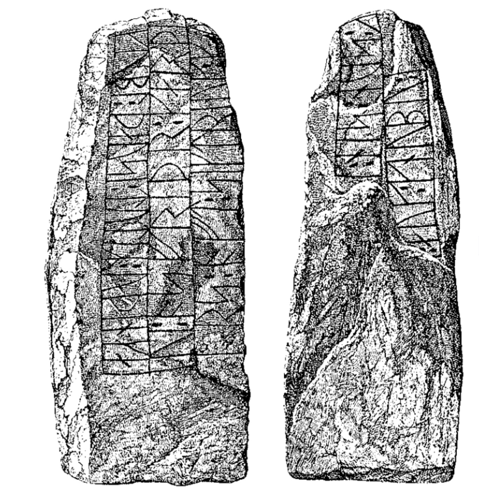

The smaller of the two Sigtrygg runestones from Hedeby was found in 1887 at Gottorf Castle. The inscription reads: “Asfrid, Odinkar’s daughter, made these monuments in memory of King Sigtrygg, her son and Gnupa’s. Gormr carved the runes.” (Department of Scandinavian languages)

Small Sigtrygg runestone, DR 4, found at Gottorf Castle (Schietzel, 180).

In the first third of the tenth century, King Gnupa, based in Hedeby, took power as ruler of the Danes. He was succeeded by his son, Sigtrygg, who was deposed shortly after 934 AD (Maixner, 90). Asfrid, his mother and Gnupa’s widow, commissioned two runestones for her deceased son, perhaps in a failed attempt to consolidate the lineage of which Sigtrygg was ultimately the final king (Maixner, 102).

---

Birgit Maixner, Haithabu - Fernhandelszentrum Zwischen Den Welten. Begleitband Zur Ausstellung Im Wikinger Museum Haithabu, 3rd ed. (Archäologisches Landesmuseum. Schloss Gottorf, 2019).

Runic inscription DR 2 in the latest (2020) edition of the Scandinavian Runic-text Database, Department of Scandinavian Languages, Uppsala University. http://kulturarvsdata.se/uu/srdb/c92f84ef-80e6-40ca-8dbb-cfb1cb693d28.

Kurt Schietzel, Unearthing Hedeby: An Archaeological Exploration of the Early Medieval Settlement of Hedeby: Documentation and Chronicle 1963-2013, with Flemming Bau et al. (Wachholtz, 2022).
