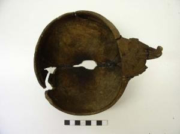

  
**Wooden bowl**

  
_Holzschale_  
(SH1979-4.4561 Wikinger Museum Haithabu)

Wooden bowls were important to the dining practices of the Viking Age. They were used both to prepare and serve meals and also, with a lid, to store and protect food from pests and contamination (Schietzel, 251). This bowl’s decorative carved handle suggests that the artistic form of “everyday” objects was valued in addition to their function.

---

Kurt Schietzel, _Unearthing Hedeby: An Archaeological Exploration of the Early Medieval Settlement of Hedeby: Documentation and Chronicle 1963-2013_, with Flemming Bau et al. (Wachholtz, 2022).
