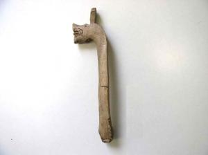

  
**Wooden spoon handle**

  
_Holzlöffel_  
(SH1979-4.4566 Wikinger Museum Haithabu)

Dragon head motifs were not uncommon in woodworking and other methods of ornamentation (Schietzel, 465). Objects in daily use sometimes had ornamentation, although it is unclear if this handle was part of a functional or decorative piece. Spoons and ladles were used for eating and serving porridge and other foods (Schietzel, 248).

---

Kurt Schietzel, _Unearthing Hedeby: An Archaeological Exploration of the Early Medieval Settlement of Hedeby: Documentation and Chronicle 1963-2013_, with Flemming Bau et al. (Wachholtz, 2022).
