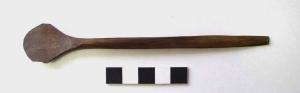

  
**Wooden spoon**

  
_Holzlöffel_  
(SH1979-4.2363 Wikinger Museum Haithabu)

Wooden spoons, typically carved from yew wood, are thought to have been used primarily for porridge (Schietzel, 248). Other uses for spoons of differing sizes include for liquid foods (tablespoons), farming (horn spoons), and personal hygiene (Schietzel, 333). Wooden spoons in the viking age may have either been personal possessions or used communally to ladle food from a communal pot  (Schietzel, 600).

---

Kurt Schietzel, _Unearthing Hedeby: An Archaeological Exploration of the Early Medieval Settlement of Hedeby: Documentation and Chronicle 1963-2013_, with Flemming Bau et al. (Wachholtz, 2022).
